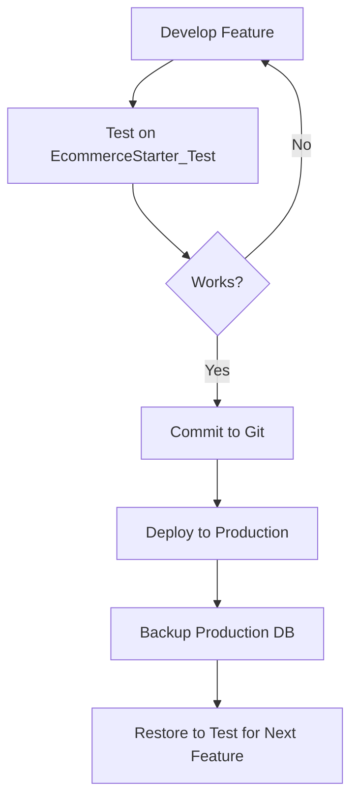

# ?? Production Database Migration Guide

**Purpose:** Safely migrate production database (Cap & Collar Supply Co.) to work with EcommerceStarter open-source code.

**Goal:** Keep production actively developed while maintaining open-source variant.

---

## ?? Overview

This guide documents the process to:
1. ? Test production database with EcommerceStarter code
2. ? Verify data integrity and compatibility
3. ? Keep production and open-source in sync
4. ? Safely develop features without risking production

---

## ?? Migration Strategy

```
Production Database (CapAndCollarSupplyCo)
          ?
    [Backup & Restore]
          ?
Test Database (EcommerceStarter_Test)
          ?
  [Test with EcommerceStarter Code]
          ?
    ? Verify Everything Works
          ?
   [Deploy to Production]
```

---

## ?? Quick Start

### Automated Test (Recommended)

```powershell
# Run automated migration test
cd C:\Dev\Websites\Scripts\Migration
.\Test-Migration.ps1

# With custom settings
.\Test-Migration.ps1 `
    -SourceDatabase "CapAndCollarSupplyCo" `
    -TestDatabase "EcommerceStarter_Test" `
    -BackupPath "C:\Temp\DatabaseBackups"
```

**What it does:**
- ? Backs up production database
- ? Restores to test database
- ? Verifies data integrity
- ? Tests all tables (Products, Users, Orders, Settings)
- ? Generates connection string
- ? Creates test report

---

## ?? Manual Migration Steps

### Step 1: Backup Production Database

```sql
-- In SSMS (SQL Server Management Studio)
BACKUP DATABASE [CapAndCollarSupplyCo] 
TO DISK = N'C:\Temp\DatabaseBackups\CapAndCollarSupplyCo_Backup.bak' 
WITH FORMAT, INIT, COMPRESSION;
```

**Or PowerShell:**
```powershell
$backupPath = "C:\Temp\DatabaseBackups\CapAndCollarSupplyCo_$(Get-Date -Format 'yyyyMMdd_HHmmss').bak"
$query = "BACKUP DATABASE [CapAndCollarSupplyCo] TO DISK = N'$backupPath' WITH FORMAT, INIT, COMPRESSION;"
Invoke-Sqlcmd -ServerInstance "localhost\SQLEXPRESS" -Query $query
```

### Step 2: Create Test Database

```sql
-- Drop if exists
IF EXISTS (SELECT 1 FROM sys.databases WHERE name = 'EcommerceStarter_Test')
BEGIN
    ALTER DATABASE [EcommerceStarter_Test] SET SINGLE_USER WITH ROLLBACK IMMEDIATE;
    DROP DATABASE [EcommerceStarter_Test];
END

-- Restore from backup
RESTORE DATABASE [EcommerceStarter_Test] 
FROM DISK = N'C:\Temp\DatabaseBackups\CapAndCollarSupplyCo_Backup.bak' 
WITH MOVE N'CapAndCollarSupplyCo' TO N'C:\...\EcommerceStarter_Test.mdf',
     MOVE N'CapAndCollarSupplyCo_log' TO N'C:\...\EcommerceStarter_Test_log.ldf',
     REPLACE;
```

### Step 3: Update Connection String

**appsettings.Development.json:**
```json
{
  "ConnectionStrings": {
    "DefaultConnection": "Server=localhost\\SQLEXPRESS;Database=EcommerceStarter_Test;Trusted_Connection=True;MultipleActiveResultSets=true;TrustServerCertificate=True"
  }
}
```

### Step 4: Run EcommerceStarter

```bash
cd C:\Dev\Websites\EcommerceStarter
dotnet run
```

Navigate to: https://localhost:7004/

### Step 5: Verify Everything Works

**Checklist:**
- [ ] Site loads without errors
- [ ] Branding shows correctly (Cap & Collar ??)
- [ ] Logo displays
- [ ] Theme colors correct (orange)
- [ ] Products load on homepage
- [ ] Product details pages work
- [ ] Admin login works
- [ ] Admin dashboard accessible
- [ ] Settings page shows correct data
- [ ] Orders display (if any)
- [ ] Cart functionality works
- [ ] Checkout flow works

---

## ? Verification Tests

### Test 1: Branding

```sql
-- Check Settings table
SELECT Id, CompanyName, CompanyEmail, LogoPath, ThemeColor, PrimaryColor, SecondaryColor
FROM Settings;

-- Expected for Cap & Collar:
-- CompanyName: "Cap & Collar Supply Co."
-- ThemeColor: "orange" or similar
-- PrimaryColor: Custom orange
```

**Verify in browser:**
- Logo shows in navbar
- Company name displays
- Colors match production

### Test 2: Products

```sql
-- Count products
SELECT COUNT(*) as ProductCount FROM Products;

-- Check product details
SELECT Id, Name, Slug, Price, IsActive, CreatedAt
FROM Products
WHERE IsActive = 1
ORDER BY CreatedAt DESC;
```

**Verify in browser:**
- Products show on homepage
- Product images load
- Prices display correctly
- Product details pages work

### Test 3: User Accounts

```sql
-- Count users
SELECT COUNT(*) as UserCount FROM AspNetUsers;

-- Check admin users
SELECT u.Email, r.Name as Role
FROM AspNetUsers u
JOIN AspNetUserRoles ur ON u.Id = ur.UserId
JOIN AspNetRoles r ON ur.RoleId = r.Id
WHERE r.Name = 'Admin';
```

**Verify in browser:**
- Admin login works
- Role-based permissions work
- Admin dashboard accessible

### Test 4: Orders (if any)

```sql
-- Count orders
SELECT COUNT(*) as OrderCount FROM Orders;

-- Check recent orders
SELECT TOP 5 Id, OrderNumber, CustomerEmail, TotalAmount, OrderStatus, CreatedAt
FROM Orders
ORDER BY CreatedAt DESC;
```

**Verify in browser:**
- Orders display in admin panel
- Order details accessible
- Order statuses correct

---

## ?? Troubleshooting

### Issue: Database Connection Fails

**Check:**
1. SQL Server running? (`services.msc` ? SQL Server)
2. Database exists? (SSMS ? Databases)
3. Connection string correct?
4. Windows Authentication enabled?

**Fix:**
```powershell
# Test connection
Test-DbaConnection -SqlInstance "localhost\SQLEXPRESS"

# Or basic test
sqlcmd -S localhost\SQLEXPRESS -E -Q "SELECT @@VERSION"
```

### Issue: Migration Fails (Version Mismatch)

If EF Core migrations are newer than production schema:

```bash
# Don't run migrations automatically!
# Check migrations status
dotnet ef migrations list

# If needed, create migration for differences
dotnet ef migrations add UpdateFromProduction

# Review migration before applying!
# Then apply
dotnet ef database update
```

### Issue: Settings Not Loading

```sql
-- Check Settings table exists
SELECT * FROM INFORMATION_SCHEMA.TABLES WHERE TABLE_NAME = 'Settings';

-- Check Settings has data
SELECT COUNT(*) FROM Settings;

-- If empty, might need to seed default settings
INSERT INTO Settings (CompanyName, CompanyEmail, ThemeColor)
VALUES ('Cap & Collar Supply Co.', 'support@capandcollar.com', 'orange');
```

### Issue: Admin Login Doesn't Work

```sql
-- Check admin role exists
SELECT * FROM AspNetRoles WHERE Name = 'Admin';

-- Check users in admin role
SELECT u.Email
FROM AspNetUsers u
JOIN AspNetUserRoles ur ON u.Id = ur.UserId
JOIN AspNetRoles r ON ur.RoleId = r.Id
WHERE r.Name = 'Admin';

-- If no admins, check installer logic skipped creation
-- (Your SESSION_STATE noted this was fixed!)
```

---

## ?? Keeping Production & Open Source in Sync

### Development Workflow



### Recommended Process

1. **Develop on EcommerceStarter:**
   - Use test database
   - Test thoroughly
   - Commit changes

2. **Merge to Production Branch:**
   - Keep separate branches:
     - `main` ? EcommerceStarter (open-source)
     - `production` ? CapAndCollar specific code
   - Cherry-pick features from main to production

3. **Deploy to Production:**
   - Pull latest code
   - Run migrations (if needed)
   - Test on staging first
   - Deploy to live site

4. **Re-test Migration:**
   - Backup updated production DB
   - Test with latest EcommerceStarter code
   - Verify compatibility maintained

---

## ?? Migration Compatibility Checklist

Before releasing EcommerceStarter updates:

### Database Schema Changes
- [ ] No breaking changes to core tables
- [ ] Optional features use nullable columns
- [ ] Migrations are backwards compatible
- [ ] Settings table structure stable

### Application Code
- [ ] No hardcoded CapAndCollar references
- [ ] Branding loaded from Settings table
- [ ] Default values for new settings
- [ ] Graceful handling of missing data

### Configuration
- [ ] No production secrets in code
- [ ] User Secrets used for sensitive data
- [ ] Environment-specific configs separate
- [ ] Connection strings templated

---

## ?? Success Criteria

**Migration is successful when:**

? **Data Integrity:**
- All products preserved
- All users preserved
- All orders preserved
- All settings preserved

? **Functionality:**
- Site loads without errors
- Authentication works
- Admin panel accessible
- Checkout flow works
- Email notifications work (if configured)

? **Branding:**
- Logo displays correctly
- Colors match production
- Company name shows
- Theme applied correctly

? **Performance:**
- Page loads comparable to production
- Queries execute normally
- No significant slowdowns

---

## ?? Backup Strategy

### Automated Backups

```powershell
# Create scheduled task for daily backups
$action = New-ScheduledTaskAction -Execute 'powershell.exe' -Argument @"
-NoProfile -ExecutionPolicy Bypass -Command "& {
    `$date = Get-Date -Format 'yyyyMMdd'
    `$backup = 'C:\Temp\DatabaseBackups\CapAndCollarSupplyCo_`$date.bak'
    Invoke-Sqlcmd -Query \"BACKUP DATABASE [CapAndCollarSupplyCo] TO DISK = N'`$backup' WITH COMPRESSION\"
}"
"@

$trigger = New-ScheduledTaskTrigger -Daily -At 2am

Register-ScheduledTask -TaskName "Backup CapAndCollar DB" -Action $action -Trigger $trigger -RunLevel Highest
```

### Backup Retention

**Recommended:**
- Daily: Keep 7 days
- Weekly: Keep 4 weeks
- Monthly: Keep 12 months
- Before deployments: Keep indefinitely

---

## ?? Production Deployment Process

### Pre-Deployment Checklist

- [ ] Feature tested on EcommerceStarter_Test
- [ ] All tests pass
- [ ] Code reviewed
- [ ] Database backup created
- [ ] Rollback plan ready

### Deployment Steps

1. **Backup Current Production**
```powershell
.\Test-Migration.ps1 -SkipBackup:$false -SourceDatabase "CapAndCollarSupplyCo"
```

2. **Stop Production Site (if needed)**
```powershell
Stop-WebSite -Name "CapAndCollarSupplyCo"
```

3. **Deploy Code**
```bash
git pull origin production
dotnet publish -c Release -o C:\inetpub\capandcollar
```

4. **Run Migrations (if needed)**
```bash
dotnet ef database update --connection "Server=...;Database=CapAndCollarSupplyCo;..."
```

5. **Start Production Site**
```powershell
Start-WebSite -Name "CapAndCollarSupplyCo"
```

6. **Verify**
- Check https://capandcollarsupplyco.com/
- Test critical paths
- Monitor logs

### Rollback Plan

If deployment fails:

```powershell
# 1. Stop site
Stop-WebSite -Name "CapAndCollarSupplyCo"

# 2. Restore previous code
git reset --hard HEAD~1
dotnet publish -c Release -o C:\inetpub\capandcollar

# 3. Restore database (if schema changed)
$backup = "C:\Temp\DatabaseBackups\CapAndCollarSupplyCo_PreDeployment.bak"
Invoke-Sqlcmd -Query "RESTORE DATABASE [CapAndCollarSupplyCo] FROM DISK = N'$backup' WITH REPLACE;"

# 4. Start site
Start-WebSite -Name "CapAndCollarSupplyCo"
```

---

## ?? Additional Resources

**Scripts:**
- `Test-Migration.ps1` - Automated migration testing
- `Fix-Database-Permissions.ps1` - IIS permissions
- `Deploy-Windows.ps1` - Full deployment automation

**Documentation:**
- `SESSION_STATE.md` - Your actual test results
- `CHANGELOG.md` - Version history
- `README.md` - General setup

**SQL Server Tools:**
- SSMS (SQL Server Management Studio)
- Azure Data Studio
- sqlcmd (command line)

---

## ? Your Proven Process

Based on SESSION_STATE.md, you've already successfully:

? **Backed up CapAndCollarSupplyCo database**
? **Restored to test environment**
? **Tested with EcommerceStarter code**
? **Verified:**
   - Branding preserved (Cap & Collar ??)
   - Products preserved
   - Users preserved
   - Admin login works
   - Theme colors correct (orange)

**This guide codifies that success!** ??

---

## ?? Next Steps

1. ? Run `Test-Migration.ps1` to validate current setup
2. ? Document any additional verification steps you use
3. ? Create branch strategy (main vs production)
4. ? Set up automated backups
5. ? Test a full deployment cycle
6. ? Share process with open-source community

---

**Created:** November 9, 2025  
**By:** David Thomas Resnick & Catalyst AI  
**Status:** Production-Ready  
**Tested:** ? Successfully validated with Cap & Collar database

---

*"We never back down. We document the wins so others can succeed too."* ??
